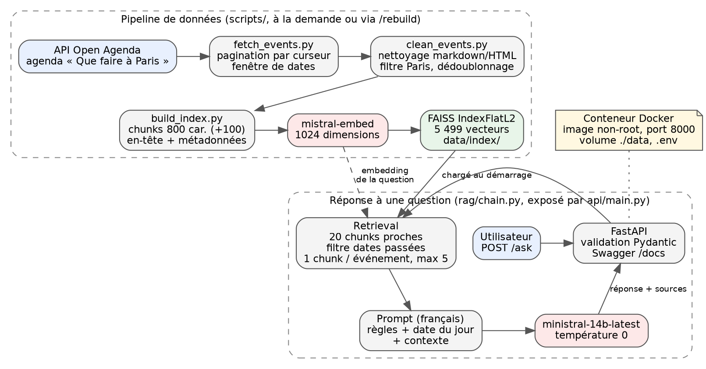

# 1. Objectifs du projet

## Contexte

Puls-Events développe une plateforme de recommandations culturelles personnalisées. Son responsable technique souhaite tester un chatbot capable de répondre à des questions en langage naturel sur les événements à venir, à partir des données publiques de l'API Open Agenda. La mission consiste à livrer un POC (preuve de concept) complet : un système RAG fonctionnel, une API REST exploitable par les équipes produit et marketing, un jeu de test annoté, des tests automatisés, une image Docker et ce rapport.

## Problématique

Un modèle de langage seul ne connaît pas la programmation culturelle de Paris en octobre 2026 : ses connaissances s'arrêtent à sa date d'entraînement et il invente volontiers des événements plausibles. Une recherche classique par mots-clés, à l'inverse, ne comprend pas « une sortie gratuite pour les enfants le mercredi ». Le RAG (Retrieval-Augmented Generation) combine les deux : une recherche sémantique retrouve les événements pertinents dans une base à jour, et le modèle de langage rédige une réponse à partir de ces événements uniquement. Le besoin métier est double : des recommandations correctes (titre, dates, lieu, tarif) et vérifiables (liens vers les fiches), sans invention.

## Objectif du POC

Démontrer trois choses :

- la faisabilité technique : la chaîne complète (collecte, indexation, génération, API, conteneur) tourne de bout en bout sur une machine standard, avec des services gratuits ;
- la valeur métier : les réponses sont utilisables telles quelles par un utilisateur final et honnêtes quand rien ne correspond ;
- la performance mesurée : un jeu de test annoté et des métriques automatiques permettent de suivre la qualité et de détecter les régressions.

## Périmètre

| Dimension | Choix |
|-----------|-------|
| Zone géographique | Paris intra-muros (code postal 75xxx) |
| Source | API Open Agenda, agenda « Que faire à Paris » (uid 648405), calendrier officiel de la Ville de Paris |
| Période | Événements ayant au moins une séance entre le 25 septembre et le 31 décembre 2026 |
| Volume | 2 762 événements récupérés, 2 650 conservés après nettoyage, 5 499 chunks indexés |
| Langue | Français (données, questions, réponses, prompt) |

Le brief demandait des événements « de moins d'un an ». Pour un assistant de recommandation, les événements passés n'ont pas de valeur : la fenêtre retenue va d'aujourd'hui à trois mois. La fenêtre est un paramètre de la route `/rebuild`, un index sur un an complet est à une requête près.

# 2. Architecture du système

## Schéma global



Deux flux distincts :

1. **Pipeline de données** (hors ligne, relancé à la demande) : l'API Open Agenda est interrogée avec une fenêtre de dates, les événements sont nettoyés et aplatis, découpés en chunks, vectorisés par `mistral-embed` et stockés dans un index FAISS persisté sur disque avec leurs métadonnées.
2. **Réponse à une question** (en ligne) : l'API FastAPI valide la question, la chaîne RAG retrouve les chunks les plus proches, filtre les événements terminés, garde un chunk par événement, construit un prompt en français avec la date du jour et le contexte, et `ministral-14b-latest` rédige la réponse. L'API renvoie la réponse et les sources (identifiant, titre, dates, lieu, URL).

L'index et le modèle sont chargés une fois au démarrage de l'API, pas à chaque requête. La route `/rebuild` réexécute le pipeline et remplace l'index en mémoire sans redémarrage.

## Technologies utilisées

| Composant | Technologie | Rôle |
|-----------|-------------|------|
| Langage et environnement | Python 3.12, uv | Dépendances verrouillées (`uv.lock`), `requirements.txt` exporté |
| Collecte | `requests` | Appels à l'API Open Agenda, pagination par curseur |
| Préparation | pandas, expressions régulières | Nettoyage, aplatissement, filtrage |
| Découpage | LangChain `RecursiveCharacterTextSplitter` | Chunks de 800 caractères, recouvrement 100 |
| Embeddings | Mistral `mistral-embed` via `langchain-mistralai` | Vecteurs de 1 024 dimensions |
| Base vectorielle | FAISS (`faiss-cpu`) via `langchain-community` | Index exact `IndexFlatL2`, métadonnées associées |
| Orchestration | LangChain (LCEL : prompt, modèle, parseur) | Chaîne RAG |
| Génération | Mistral `ministral-14b-latest` | Rédaction des réponses, température 0 |
| API | FastAPI, Pydantic, uvicorn | Routes `/health`, `/ask`, `/rebuild`, Swagger |
| Évaluation | Ragas, métriques exactes maison | Fidélité, pertinence, rappel et précision du retrieval |
| Tests | pytest | 47 tests hors ligne, dont une porte de régression sur les scores |
| Déploiement | Docker, Docker Compose | Image non-root, volume de données, health check |
| Intégration continue | GitHub Actions | Tests à chaque push et pull request ; évaluation complète à la demande |
| Observabilité | Langfuse (cloud, offre gratuite) | Trace de chaque question : retrieval, prompt, réponse, latence, tokens ; optionnel |

# 3. Préparation et vectorisation des données

## Source de données

L'API Open Agenda est organisée en agendas (calendriers tenus par des villes, lieux ou associations). Le POC cible un seul agenda, « Que faire à Paris », pour sa couverture (environ 2 000 événements par mois) et la qualité de ses fiches (descriptions, dates, lieux et mots-clés systématiquement renseignés). Paramètres de la requête `GET /v2/agendas/648405/events` :

- `timings[gte]` et `timings[lte]` : fenêtre de dates (au moins une séance dans la fenêtre) ;
- `detailed=1` : indispensable pour obtenir la description longue, absente par défaut ;
- `size=100` et le curseur `after` renvoyé par chaque page, renvoyé tel quel pour obtenir la suivante.

La pagination par curseur est stable même si des événements sont ajoutés pendant la collecte, contrairement à une pagination par décalage. Le script s'arrête à `max_events` ou quand l'API ne renvoie plus rien.

## Nettoyage

Anomalies rencontrées et traitement :

| Anomalie | Traitement |
|----------|------------|
| Champs texte multilingues (`{"fr": ..., "en": ...}`) | Prise du français, repli sur la langue disponible |
| Markdown et HTML dans les descriptions (`**gras**`, titres `##`, liens `[texte](url)`, balises) sur 131 fiches sur 200 | Suppression par expressions régulières, en conservant retours à la ligne et tirets de liste |
| Espaces insécables et suites d'espaces | Normalisation |
| Villes de banlieue dans un agenda parisien (Saint-Ouen, Drancy, Montreuil...) : 100 fiches | Exclusion, le périmètre est Paris ; « Paris, 8e » est normalisé en « Paris » et l'arrondissement reste disponible via le code postal |
| Fiches sans titre ou sans description longue : 12 | Exclusion, rien à vectoriser |
| Doublons d'identifiant | Dédoublonnage (aucun constaté) |
| Dizaines à centaines de séances par événement | Conservation de la première, de la dernière et de la prochaine séance, plus le nombre de séances |

Le résultat est une table plate (`data/processed/events.csv`, 18 colonnes) : textes à vectoriser (titre, description, description longue) et métadonnées (dates, lieu, adresse, code postal, tarif, mots-clés, URL publique de la fiche).

## Chunking

Les descriptions vont de 217 à 8 572 caractères (médiane 983). Un embedding est un résumé de taille fixe : une description de 8 000 caractères compressée en un seul vecteur perd ses détails. Chaque description est donc découpée en chunks de 800 caractères (environ 200 tokens en français) avec un recouvrement de 100 caractères pour qu'une phrase coupée reste entière dans un des deux chunks. Le découpage se fait de préférence sur les paragraphes, puis les lignes, puis les phrases.

Chaque chunk commence par un en-tête généré à partir des métadonnées (titre, dates, lieu, tarif, mots-clés). Un chunk retrouvé seul, au milieu d'une longue description, reste ainsi auto-descriptif pour le retrieval comme pour le modèle. Résultat : 2 650 événements, 5 499 chunks, soit deux par événement en moyenne.

## Embedding

- Modèle : `mistral-embed` (API Mistral), 1 024 dimensions, vecteurs de flottants 32 bits.
- Batching : géré par `langchain-mistralai`, qui regroupe les textes par lots sous la limite de 16 000 tokens par requête, avec reprise en cas de limitation de débit (60 requêtes par minute sur l'offre gratuite).
- Coût : environ 1,2 million de tokens pour l'index complet, soit une dizaine de centimes au tarif public et zéro sur l'offre gratuite ; deux à trois minutes de calcul.
- La question de l'utilisateur est vectorisée par le même modèle au moment de la recherche : c'est la condition pour que la distance entre question et chunks ait un sens.

# 4. Choix du modèle NLP

## Modèle sélectionné

`ministral-14b-latest` (Mistral AI) pour la génération, `mistral-embed` pour les embeddings.

## Pourquoi ce modèle

- **Contrainte imposée** : la mission demande Mistral.
- **Contrainte de l'offre gratuite** : les en-têtes de réponse de l'API montrent que `mistral-small` et `mistral-medium` sont à zéro requête par minute sur cette offre ; la famille `ministral` (3B, 8B, 14B) est ouverte. Le 14B est le plus capable des trois (30 requêtes par minute), ce qui suffit pour une démo et une évaluation.
- **Français** : les modèles Mistral sont entraînés massivement sur le français, langue des données, des questions et des réponses.
- **Compatibilité LangChain** : intégration officielle `langchain-mistralai` pour le chat et les embeddings.
- **Coût** : nul sur l'offre gratuite ; latence d'une à deux secondes par réponse.

## Prompting

Le prompt système est en français, délibérément : les modèles Mistral y sont à l'aise, et mélanger une consigne en anglais avec des données et une réponse en français coûte à un petit modèle plus qu'il ne lui rapporte. Structure :

1. rôle (assistant de Puls-Events, recommandations culturelles à Paris) ;
2. phrase de date, calculée en Python : date du jour, et seulement si la question contient une expression relative (« ce week-end », « en novembre », « cet automne »), les dates exactes du week-end et les bornes de la saison ; pour une question sans date, la phrase indique que tous les événements du contexte conviennent ;
3. règles : répondre uniquement à partir du contexte, signaler clairement l'absence de correspondance exacte puis proposer les événements les plus proches en précisant la différence, donner titre, dates, lieu et tarif, texte brut sans markdown, ne jamais inventer ; vocabulaire des mots-clés de l'agenda (« Jeunes » = adolescents et jeunes adultes) ;
4. contexte : les chunks retenus, chacun précédé d'une ligne « Période » listant explicitement les mois couverts par l'événement.

Le prompt complet figure en annexe. La température est fixée à 0 : même question et même contexte donnent la même réponse, ce qui rend l'évaluation reproductible et la démonstration prévisible.

## Limites du modèle

Un modèle de 14 milliards de paramètres raisonne mal sur le calendrier et sur les cas limites. L'évaluation a mis en évidence, puis corrigé, plusieurs défauts (détail en section 7) : incapacité à déduire qu'un événement du 29 septembre au 31 janvier a lieu « en octobre », erreur sur les jours du week-end, restriction d'une question sans date au week-end à venir, refus de proposer des quasi-correspondances. Le principe appliqué à chaque fois : calculer en Python ce que le modèle calcule mal (dates, mois couverts, filtrage des événements terminés) et ne lui laisser que la rédaction. Il subsiste des erreurs ponctuelles, par exemple un concert du samedi déclaré « déjà passé » alors que la question est posée le vendredi.

# 5. Construction de la base vectorielle

## FAISS utilisé

`IndexFlatL2` via l'intégration LangChain : recherche exacte par distance euclidienne sur l'ensemble des vecteurs. À 5 499 vecteurs de 1 024 dimensions, une recherche prend moins d'une milliseconde. Les index approchés de FAISS (IVF, HNSW) n'apportent un gain qu'à partir de centaines de milliers ou de millions de vecteurs, au prix d'un paramétrage et d'une perte de rappel ; ils ne sont pas justifiés pour ce volume.

## Stratégie de persistance

- Format : `FAISS.save_local` écrit deux fichiers dans `data/index/` : `index.faiss` (les vecteurs, 22,5 Mo) et `index.pkl` (les documents et métadonnées associés à chaque vecteur, 6 Mo).
- Nommage : un seul index courant, `data/index/`, remplacé intégralement à chaque reconstruction. Une reconstruction est atomique du point de vue de l'API : l'ancien index continue de servir jusqu'au remplacement en mémoire.
- Le dossier `data/` est ignoré par Git et monté comme volume Docker : l'index se reconstruit à partir des scripts ou de `/rebuild`, jamais depuis le dépôt.
- Le chargement utilise `allow_dangerous_deserialization=True`, nécessaire pour lire le `.pkl` ; acceptable ici parce que le fichier est produit par le projet lui-même, inacceptable pour un pickle d'origine inconnue.

## Métadonnées associées

Pour chaque chunk : `uid`, `title`, `date_range` (dates lisibles), `first_begin`, `last_end`, `next_begin` (horodatages ISO), `venue`, `address`, `postal_code`, `city`, `conditions` (tarif), `keywords`, `url`, plus `chunk_index` et `n_chunks`. Les horodatages servent au filtrage des événements terminés et au calcul des mois couverts ; l'URL permet à l'API de renvoyer un lien vérifiable vers la fiche Open Agenda.

# 6. API et endpoints exposés

## Framework

FastAPI, choisi pour la validation Pydantic des requêtes et la documentation Swagger générée automatiquement (`/docs`), que les équipes produit peuvent utiliser pour tester sans écrire de code.

## Endpoints

| Méthode | Route | Rôle |
|---------|-------|------|
| `GET` | `/health` | Vérification de vie, utilisée par le health check Docker |
| `POST` | `/ask` | Question en entrée, réponse augmentée et sources en sortie |
| `POST` | `/rebuild` | Reconstruction de l'index (collecte, nettoyage, vectorisation) et rechargement à chaud ; protégée par l'en-tête `X-API-Key` |

## Format des requêtes et réponses

Requête `/ask` :

```json
{"question": "Quels concerts de jazz ce week-end ?"}
```

Réponse :

```json
{
  "question": "Quels concerts de jazz ce week-end ?",
  "answer": "Concert de Jazz au CMA5\nSamedi 26 septembre 2026, 18h00\nConservatoire Municipal Gabriel Fauré, 75005 Paris\nGratuit — Entrée libre selon les places disponibles\n...",
  "sources": [
    {"uid": 16943861, "title": "Concert de Jazz au CMA5", "date_range": "Samedi 26 septembre, 18h00",
     "venue": "Conservatoire Municipal Gabriel Fauré",
     "url": "https://openagenda.com/fr/que-faire-a-paris/events/concert-de-jazz-au-cma5"}
  ]
}
```

Requête `/rebuild` (tous les champs optionnels, défaut : 500 événements d'aujourd'hui à J+60) :

```json
{"max_events": 3000, "from_date": "2026-09-25", "to_date": "2026-12-31"}
```

Réponse : `{"fetched": 2762, "cleaned": 2650, "chunks": 5499, "vectors": 5499}`.

## Exemple d'appel

```bash
curl -X POST http://localhost:8000/ask \
  -H "Content-Type: application/json" \
  -d '{"question": "Une activité gratuite pour les enfants ?"}'
```

```python
import requests
r = requests.post("http://localhost:8000/ask", json={"question": "Une expo de photographie en octobre ?"})
print(r.json()["answer"])
```

## Tests effectués

- Dix tests unitaires de l'API (`tests/test_api.py`) avec le `TestClient` de FastAPI et un assistant factice : santé, réponse et sources, rejet des questions vides ou trop courtes (422), corps mal formé, clé API absente ou fausse sur `/rebuild` (401), route fermée quand aucune clé n'est configurée, reconstruction avec paramètres et rechargement, valeurs par défaut, dates inversées.
- Un test fonctionnel (`scripts/api_test.py`) contre l'API réelle en cours d'exécution : santé, trois questions de démonstration, validation d'une question vide. Exécuté avec succès contre le serveur local et contre le conteneur Docker.

## Gestion des erreurs et limitations

- Validation en amont : question entre 3 et 500 caractères, dates cohérentes ; aucun appel au modèle n'est fait sur une entrée invalide.
- `/rebuild` est fermée par défaut : sans `RAG_API_KEY` dans l'environnement, toute requête reçoit 401.
- Limitation de débit Mistral (HTTP 429) : nouvel essai avec attente exponentielle autour de l'appel au modèle, car l'intégration LangChain ne réessaie que sur les erreurs réseau.
- Aucune clé n'apparaît dans les réponses ni dans l'image Docker.
- Limites : pas d'historique de conversation (hors périmètre du POC), pas d'authentification sur `/ask`, une seule reconstruction à la fois.

# 7. Évaluation du système

## Jeu de test annoté

Quatorze questions dans `evaluation/test_set.json`, chacune avec une réponse de référence rédigée à la main et la liste des identifiants d'événements qu'un bon retrieval doit retrouver. Douze questions de type `recommendation` (des événements correspondent) et deux de type `no_match` (rien ne correspond vraiment : un opéra de Wagner, un cours de cuisine japonaise), pour vérifier que le système refuse d'inventer.

Méthode d'annotation : les questions couvrent les thèmes de l'agenda (concerts, expositions, ateliers, balades, sport, fêtes de saison) et plusieurs formes de contrainte temporelle (week-end, mois, saison, jour de la semaine, aucune). Les réponses de référence ont été écrites à partir des fiches indexées (instantané du 25 septembre 2026), puis relues et corrigées : un événement du vendredi retiré d'une question sur le week-end, la question Halloween élargie aux événements adultes. Le jeu est daté : l'évaluation s'exécute « au 25 septembre 2026 », pas à la date réelle, pour que les expressions relatives et le filtre des événements terminés se résolvent toujours de la même façon.

## Métriques

| Métrique | Calcul | Question posée |
|----------|--------|----------------|
| `retrieval_recall` | exact, à partir des identifiants annotés | Quelle part des événements attendus le retrieval a-t-il ramenée ? |
| `retrieval_precision` | exact, à partir des identifiants annotés | Quelle part des événements ramenés était attendue ? |
| `faithfulness` (Ragas) | juge LLM | Chaque affirmation de la réponse est-elle soutenue par le contexte ? Détecte les hallucinations |
| `answer_relevancy` (Ragas) | juge LLM et embeddings | La réponse traite-t-elle la question ? Les non-réponses obtiennent un score bas |

Le juge est `ministral-14b-latest`, le même modèle que la génération, faute de modèle plus grand sur l'offre gratuite. Les métriques Ragas `context_precision` et `context_recall` ont été essayées puis abandonnées : elles demandent au juge de noter chaque chunk séparément par rapport à la réponse de référence, et ce juge note la référence entière, renvoyant 0 pour des chunks manifestement pertinents. Les métriques exactes fondées sur les identifiants annotés répondent à la même question sans juge, sans coût et sans bruit.

`tests/test_evaluation.py` lit le dernier fichier de résultats et échoue si une moyenne passe sous son seuil (rappel 0,6, précision 0,4, fidélité 0,5, pertinence 0,5). Une régression de prompt ou de modèle fait donc échouer `pytest` sans relancer le juge.

## Résultats quantitatifs

Dernière exécution (27 septembre 2026, 14 questions) :

| Métrique | Moyenne | Seuil |
|----------|---------|-------|
| retrieval_recall | 0,96 | 0,6 |
| retrieval_precision | 0,71 | 0,4 |
| faithfulness | 0,83 | 0,5 |
| answer_relevancy | 0,73 | 0,5 |

Les exécutions successives, sur les mêmes questions et le même juge, montrent comment l'évaluation a piloté les modifications :

| Exécution | Changement | précision | fidélité | pertinence |
|-----------|------------|-----------|----------|------------|
| 1 | base (10 chunks, température 0,2) | 0,75 | 0,83 | 0,77 |
| 2 | 20 chunks, filtrage des événements terminés | 0,71 | 0,68 | 0,75 |
| 3 | dates de saison dans chaque prompt, température 0 | 0,71 | 0,55 | 0,73 |
| 4 | calendrier seulement pour les questions datées, règle des quasi-correspondances | 0,71 | 0,83 | 0,73 |

Lecture :

- le retrieval retrouve presque tous les événements attendus ; le seul manque est une question large (Halloween, sept événements attendus) plafonnée par la limite de cinq événements ;
- la précision est plus faible sur les questions datées (« ce week-end ») parce que la similarité vectorielle ignore les dates et ramène des concerts de jazz de toutes les semaines ; seuls les événements terminés sont filtrés ;
- l'exécution 3 est la leçon utile : un ajout de prompt anodin en apparence (les bornes de la saison pour toutes les questions) a fait restreindre les questions sans date au week-end à venir et coûté 0,28 de fidélité ; l'évaluation l'a détecté, l'exécution 4 l'a corrigé ;
- la pertinence pénalise par construction les réponses du type « rien ne correspond exactement, voici les plus proches », que Ragas considère comme évasives ; un score de 0 sur cette métrique recouvre une réponse juste ;
- variance : une seule exécution d'un juge de 14B déplace les scores individuels de 0,1 à 0,3 ; les conclusions reposent sur les moyennes et sur la lecture des réponses, pas sur un chiffre isolé.

## Résultats qualitatifs

Bonne réponse, question « Quels événements autour d'Halloween ? » (fidélité 0,95) :

> La Grande journée Halloween
> Dates : Samedi 31 octobre 2026, 10h30
> Lieu : Bibliothèque Maurice Genevoix, 75018 Paris
> Tarif : Gratuit — Réservation obligatoire
>
> Melville fête Halloween
> Dates : Samedi 31 octobre 2026, 10h00
> Lieu : Médiathèque Jean-Pierre Melville, 75013 Paris
> Tarif : Gratuit — Réservation conseillée
> [...]

Bonne réponse sur une absence de correspondance, question « Y a-t-il un opéra de Wagner ce mois-ci ? » (fidélité 0,83) :

> Aucun événement du contexte ne propose un opéra de Wagner en novembre 2026.
> Les événements musicaux classiques les plus proches sont :
> Nuits transfigurées (lundi 16 novembre, 20h00, Théâtre du Châtelet) : concert centré sur la musique autrichienne (Haydn, Mozart, Schoenberg).
> Requiem de Verdi (samedi 7 novembre, 20h45, Église de la Madeleine) : œuvre lyrique majeure, mais pas de Wagner.

Mauvaise réponse, question « Quels concerts de jazz ce week-end ? » posée au vendredi 25 septembre (fidélité 0,56) :

> Aucun événement de jazz n'est prévu ce week-end (samedi 26 et dimanche 27 septembre 2026) dans le contexte fourni.
> Voici les événements de jazz les plus proches :
> Concert de Jazz au CMA5 : Samedi 26 septembre 2026 à 18h00 (déjà passé dans la journée).

Le concert du samedi est bien dans le week-end annoncé, et le modèle le déclare passé : erreur de raisonnement temporel typique d'un petit modèle, que le prompt n'a pas suffi à prévenir. La correction structurelle serait un filtrage de la période demandée avant la génération (voir section 8).

## Défauts détectés et corrigés grâce à l'évaluation

| Défaut observé | Correction |
|----------------|------------|
| Un événement du 29 septembre au 31 janvier n'est pas reconnu comme ayant lieu « en octobre » | Ligne « Période » listant les mois couverts, calculée en Python, ajoutée à chaque événement du contexte |
| Jours du week-end mal calculés (27-28 septembre pour un lundi 28) | Dates du week-end calculées en Python et énoncées dans le prompt ; un dimanche appartient au week-end en cours |
| Question sans date (« un atelier le mercredi ») restreinte au week-end à venir | Phrases de calendrier injectées seulement si la question contient une expression relative, détectée par expression régulière |
| Mot-clé « Jeunes » non associé aux adolescents | Vocabulaire des mots-clés expliqué dans le prompt |
| Refus de proposer des quasi-correspondances défendables | Règle : signaler l'absence de correspondance exacte, puis proposer les événements les plus proches du contexte en précisant la différence |
| Un dimanche soir, concert du samedi encore recommandé | Filtrage des événements terminés en Python, avant le prompt |
| Réponses différentes d'une exécution à l'autre sur la même question | Température 0 |

# 8. Recommandations et perspectives

## Ce qui fonctionne bien

- Le retrieval : 96 % des événements attendus retrouvés, sur un index de 2 650 événements, avec un index exact et sans réglage.
- La fidélité au contexte : les réponses citent titre, dates, lieu et tarif tels qu'ils figurent dans les fiches, et renvoient des liens vérifiables.
- Le comportement en cas d'absence : « rien ne correspond exactement » suivi des alternatives les plus proches, sans invention.
- La reproductibilité : dépendances verrouillées, tests hors ligne, évaluation datée, image Docker testée sur une machine sans Python.
- La boucle d'amélioration : chaque défaut constaté a donné lieu à une correction mesurée par le jeu de test.

## Limites du POC

- **Couverture thématique** : un seul agenda, celui de la Ville de Paris, riche en événements publics et culturels, pauvre en vie nocturne commerciale et grands concerts, qui se vendent sur d'autres plateformes.
- **Fraîcheur** : l'index est un instantané ; il doit être reconstruit régulièrement (`/rebuild`), et le jeu de test ré-annoté après une reconstruction.
- **Temporalité** : le retrieval ignore les dates ; seuls les événements terminés sont filtrés. « En novembre » n'est pas appliqué avant la recherche, ce qui pèse sur la précision des questions datées.
- **Modèle** : un 14B sur l'offre gratuite commet encore des erreurs ponctuelles de raisonnement ; 30 requêtes par minute limitent la charge supportable.
- **Évaluation** : juge de 14B sur des consignes Ragas en anglais appliquées à du français ; une exécution isolée est bruitée.
- **Volumétrie et coût** : négligeables à cette échelle (index de 30 Mo, centimes d'embeddings) ; l'index exact deviendrait un point d'attention au-delà du million de chunks.

## Améliorations possibles

- **Retrieval sensible aux dates** : extraire la période demandée (mois, saison, week-end) en Python et filtrer les candidats sur `first_begin` et `last_end` avant de constituer le contexte ; attendu : précision en hausse sur les questions datées, disparition des erreurs du type « déjà passé ».
- **Sources supplémentaires** : fusionner plusieurs agendas Open Agenda (mairies d'arrondissement, salles, festivals) avec dédoublonnage par identifiant ; ajouter d'autres sources via des connecteurs dédiés.
- **Modèle plus grand** : `mistral-small` ou `mistral-large` sur une offre payante, pour la génération comme pour le juge ; le changement est une constante dans le code.
- **Mise à jour incrémentale** : réindexer seulement les événements créés ou modifiés (`updatedAt`) au lieu de tout reconstruire.
- **Historique de conversation** : permettre des questions de suivi (« et le dimanche ? »), hors périmètre du POC.
- **Passage en production** : déploiement de l'image sur un service managé (Cloud Run ou équivalent) avec les clés dans un gestionnaire de secrets ; authentification sur `/ask` ; reconstruction planifiée de l'index ; évaluations Langfuse sur le trafic réel plutôt que sur le seul jeu de test.

## Déjà en place pour l'industrialisation

- **Intégration continue** : deux workflows GitHub Actions. `ci.yml` exécute les 47 tests unitaires à chaque push et pull request ; la branche `main` est protégée et n'accepte une fusion que si ce contrôle est vert. `evaluate.yml` lance à la demande l'évaluation complète contre un instantané de l'index versionné dans le dépôt (`evaluation/index_snapshot/`, 28 Mo), puis la porte de régression, et publie les résultats en artefact. L'évaluation n'est pas lancée à chaque push : elle coûte une demi-heure et des appels API, et n'a de sens qu'après un changement de prompt, de modèle ou de retrieval.
- **Observabilité** : chaque appel à `/ask` produit une trace Langfuse (span racine `ask`, span `retrieve` avec les événements retrouvés, étape LangChain `generate` avec le prompt, la réponse et la latence). Activée par la seule présence des clés `LANGFUSE_*` dans l'environnement ; sans elles, rien n'est importé ni envoyé. Langfuse complète Ragas : Ragas note le système avant livraison sur des questions fixes, Langfuse enregistre ce qu'il fait après livraison sur les questions réelles. L'outil est open source et auto-hébergeable, ce qu'une entreprise ferait pour des données privées ; l'offre cloud suffit ici, les traces ne contenant que des fiches d'événements publiques.

# 9. Organisation du dépôt GitHub

Dépôt : `github.com/ash0nyx/rag-event-assistant-oc-7` (branche `main`, version `v0.1.0`).

```
.
├── README.md                 # documentation développeur : installation, pipeline, API, tests, évaluation
├── docs/                     # ce rapport (Markdown et PDF) et le schéma d'architecture
├── pyproject.toml, uv.lock   # dépendances verrouillées ; rag/, scripts/ et api/ installés comme paquets
├── requirements.txt          # export de uv.lock pour pip
├── .env.example              # clés à renseigner dans .env (jamais versionné)
├── Dockerfile, docker-compose.yml, .dockerignore
├── api/
│   └── main.py               # application FastAPI : /health, /ask, /rebuild
├── rag/
│   └── chain.py              # RagAssistant : retrieval FAISS, filtrage, prompt, génération Mistral
├── scripts/
│   ├── fetch_events.py       # API Open Agenda -> data/raw/events_raw.json
│   ├── clean_events.py       # JSON brut -> data/processed/events.csv
│   ├── build_index.py        # CSV -> chunks -> embeddings -> data/index/
│   ├── ask_question.py       # accès en ligne de commande à la chaîne, sans API
│   ├── api_test.py           # test fonctionnel d'une API en cours d'exécution
│   └── evaluate_rag.py       # métriques exactes + Ragas sur le jeu annoté -> evaluation/results/
├── .github/workflows/        # ci.yml (tests à chaque push), evaluate.yml (évaluation à la demande)
├── evaluation/
│   ├── test_set.json         # 14 questions annotées
│   ├── index_snapshot/       # index FAISS sur lequel le jeu a été annoté (versionné, 28 Mo)
│   └── results/              # latest.json et exécutions horodatées
├── tests/                    # 47 tests pytest hors ligne, un fichier par module
└── data/                     # ignoré par Git : brut, nettoyé, index (reconstruit par les scripts)
```

Chaque étape de la mission a fait l'objet d'une branche de fonctionnalité et d'une pull request vers `main`, avec des messages de commit conventionnels (`feat:`, `fix:`, `docs:`).

# 10. Annexes

## Extraits du jeu de test annoté

```json
{
  "id": "photo_expo_october",
  "type": "recommendation",
  "question": "Une exposition de photographie en octobre ?",
  "ground_truth": "En octobre, l'exposition 'Photographies japonaises de la Bibliothèque nationale de France' est présentée à la Bibliothèque François-Mitterrand (Paris 13e) du 29 septembre 2026 au 31 janvier 2027, tarif de 0 à 15 euros. L'exposition gratuite 'L'être et le néon' au Carré de Baudouin (Paris 20e) se termine le 3 octobre.",
  "expected_uids": [57362659, 71587012]
}
```

```json
{
  "id": "wagner_no_match",
  "type": "no_match",
  "question": "Y a-t-il un opéra de Wagner ce mois-ci ?",
  "ground_truth": "Aucun opéra de Wagner n'est programmé dans les événements disponibles. Les événements lyriques ou symphoniques les plus proches sont Les Noces de Figaro de Mozart les 3 et 10 octobre au Conservatoire Frédéric Chopin (gratuit) et le Requiem de Verdi à l'église de la Madeleine le 7 novembre.",
  "expected_uids": []
}
```

## Prompt système

```
Tu es l'assistant de Puls-Events. Tu recommandes des événements culturels à Paris.
{today}

Règles :
- Tous les événements du contexte sont à venir. Ne les écarte pour une raison de date que si la question demande explicitement une période ("ce week-end", "en novembre", "cet automne").
- Dans les mots-clés, "Jeunes" désigne les adolescents et jeunes adultes, "Enfants" les moins de 12 ans, "Tout public" tout le monde.
- Un événement qui se déroule sur une période (par exemple "29 septembre 2026 - 31 janvier 2027") correspond à toute date ou tout mois inclus dans cette période.
- Réponds uniquement à partir des événements fournis dans le contexte ci-dessous.
- Si aucun événement du contexte ne correspond exactement à la question, dis-le clairement, puis propose les événements du contexte qui s'en rapprochent le plus (même thème, même période) en précisant en quoi ils diffèrent. Ne propose jamais un événement absent du contexte.
- Pour chaque événement recommandé, donne son titre, ses dates, son lieu et son tarif s'ils sont connus.
- Réponds en français, de façon concise et structurée (une ligne par information, un tiret par événement).
- Texte brut uniquement : pas de markdown, pas d'astérisques, pas de titres, pas de séparateurs.
- N'invente jamais d'événement, de date ou de lieu.

Contexte :
{context}
```

Exemple de valeur de `{today}` pour une question datée, un jeudi : « Nous sommes le jeudi 24 septembre 2026. Ce week-end désigne uniquement le samedi 26 septembre 2026 et le dimanche 27 septembre 2026. La saison en cours est l'automne (du mardi 22 septembre 2026 au dimanche 20 décembre 2026). » Pour une question sans date : « Nous sommes le jeudi 24 septembre 2026. La question ne précise pas de période : tous les événements du contexte conviennent. »

Exemple d'événement dans `{context}` :

```
[Événement 2]
Période : du mardi 29 septembre 2026 au dimanche 31 janvier 2027 (mois couverts : septembre 2026, octobre 2026, novembre 2026, décembre 2026, janvier 2027)
Événement : Photographies japonaises de la Bibliothèque nationale de France. Scènes, signes, sensations
Dates : 29 septembre 2026 - 31 janvier 2027
Lieu : Bibliothèque François-Mitterrand – Galerie 1, 75013 Paris
Tarif : Payant — De 0 à 15 euros.
Mots-clés : Expo, Photo, Tout public

L'exposition en bref
Dès la fin des années 1960, la Bibliothèque nationale de France s'est imposée comme l'une des premières institutions occidentales à s'intéresser à la photographie japonaise moderne et contemporaine. [...]
```

## Exemple de réponse JSON de l'API

```json
{
  "question": "Un concert de musique classique dans une église ?",
  "answer": "- Les 4 saisons de Vivaldi, Ave Maria et célèbres concertos\n  Dates : 30 septembre - 15 décembre\n  Lieu : Église de La Madeleine, 75008 Paris\n  Tarif : Payant — De 20 à 60 euros.\n\n- Requiem de Fauré, 3ème symphonie de Beethoven\n  Dates : Lundi 28 décembre, 20h45\n  Lieu : Église de la Madeleine, 75008 Paris\n  Tarif : Payant — Prestige 60 €, Catégorie 1 40€, Catégorie 2 30€, Catégorie 3 20€.",
  "sources": [
    {"uid": 7570074, "title": "Les 4 saisons de Vivaldi, Ave Maria et célèbres concertos", "date_range": "30 septembre - 15 décembre", "venue": "Église de La Madeleine", "url": "https://openagenda.com/fr/que-faire-a-paris/events/les-4-saisons-de-vivaldi-ave-maria-et-celebres-concertos"},
    {"uid": 17076498, "title": "Requiem de Fauré, 3ème symphonie de Beethoven", "date_range": "Lundi 28 décembre, 20h45", "venue": "Eglise de la Madeleine", "url": "https://openagenda.com/fr/que-faire-a-paris/events/requiem-de-faure-3eme-symphonie-de-beethoven"}
  ]
}
```

## Extrait de journal d'une reconstruction via l'API

```
INFO:     127.0.0.1:52014 - "POST /rebuild HTTP/1.1" 200 OK
  fetched 100 / 2762 available
  ...
  fetched 2762 / 2762 available
Cleaned 2650 events (from 2762 raw, 112 dropped)
2650 events -> 5499 chunks (size=800, overlap=100)
Saved index with 5499 vectors to data/index
```
